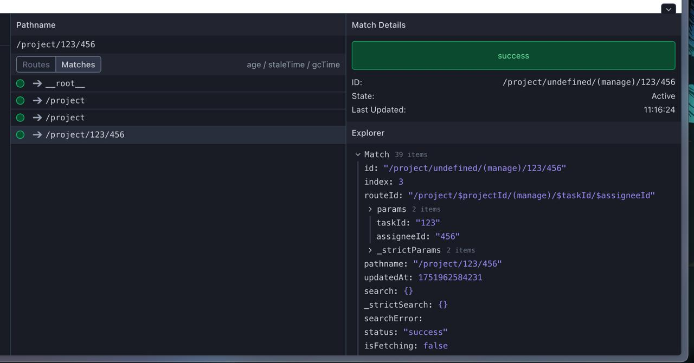

# TanStack Router Routing Bug

```shell
pnpm install
pnpm dev
```

Navigate to [the task page](http://localhost:3000/project/123/456).

For some reason, the `$projectId` param is `undefined` while the `$taskId` is `123` and `$assigneId` is `456`:


